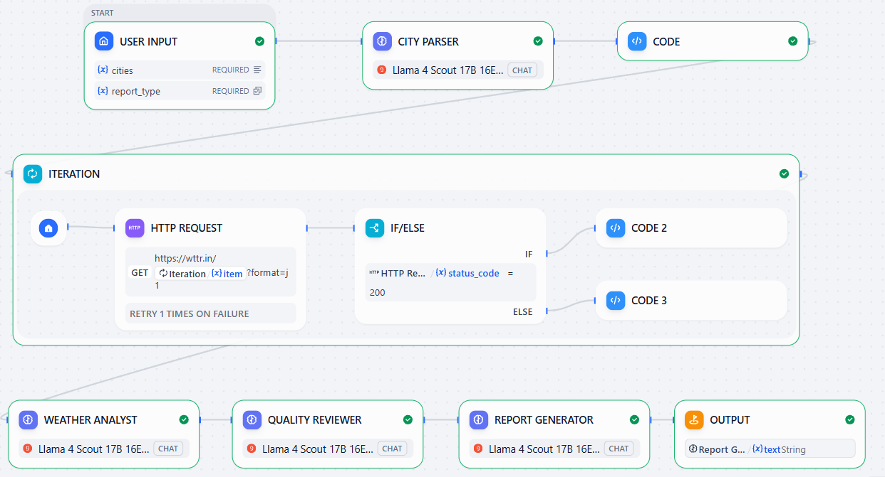

# Weather ETL Agentic Workflow 🌦️🤖

An advanced AI-driven ETL (Extract, Transform, Load) pipeline built using **Dify** and **Llama 4 Scout**. This project demonstrates an agentic multi-LLM chain that automates weather data collection, expert analysis, and quality-controlled reporting for major Indian cities.

## 🚀 Workflow Architecture

This agent utilizes a 10-node pipeline to ensure data accuracy and high-quality insights:
1. **City Parser (LLM):** Normalizes user input into valid JSON.
2. **Data Extraction (HTTP/Code):** Fetches live weather data via `wttr.in`.
3. **Weather Analyst (LLM):** Ranks cities, detects anomalies, and assigns risk levels.
4. **Quality Reviewer (LLM):** Critiques the analyst's findings against raw data.
5. **Report Generator (LLM):** Synthesizes all inputs into a polished executive summary.

## 📁 Repository Contents
- `Weather_ETL_V1_Lokesh_Jasrotia.yml`: The complete Dify DSL file (import this to Dify to run the agent).
- `Weather_Report_Lokesh_Jasrotia.txt`: A sample output generated by the pipeline.

## 🛠️ Technologies Used
- **Dify.ai**: Orchestration platform.
- **Llama 4 Scout 17B (Groq)**: Primary LLM for analysis and reasoning.
- **Python**: Custom parsing logic in Code nodes.
- **wttr.in API**: Live weather data source.

## 📖 How to Use
1. Download the `.yml` file from this repository.
2. Log in to your **Dify** account.
3. Click **Import DSL** and upload the file.
4. Configure your **Groq API Key** in Dify's Model Provider settings.
5. Run the workflow and enter your desired Indian cities!
